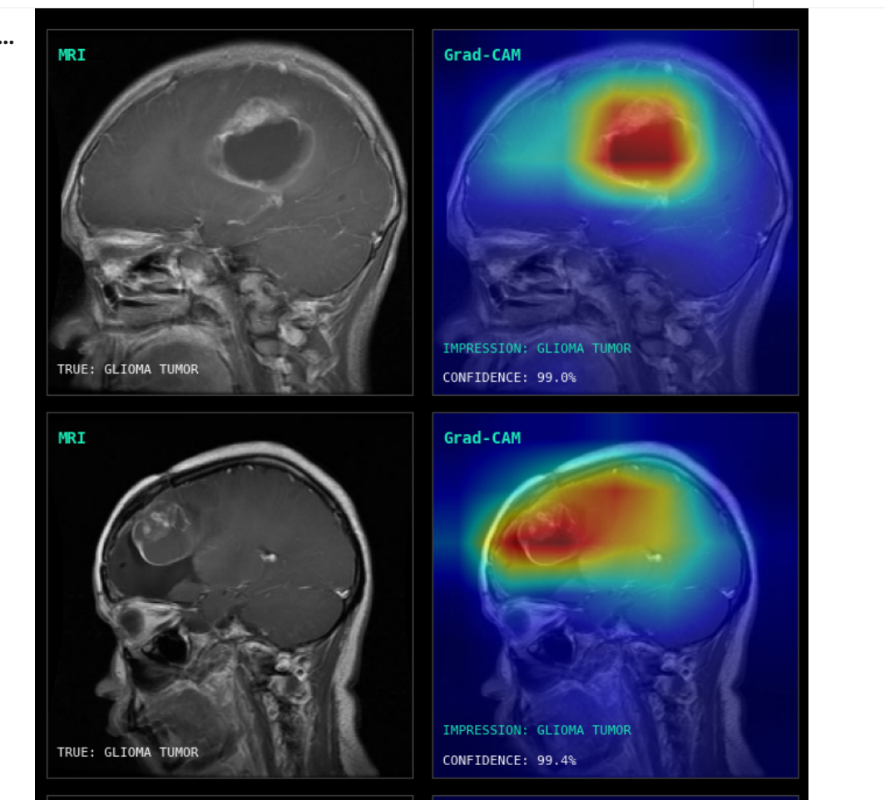
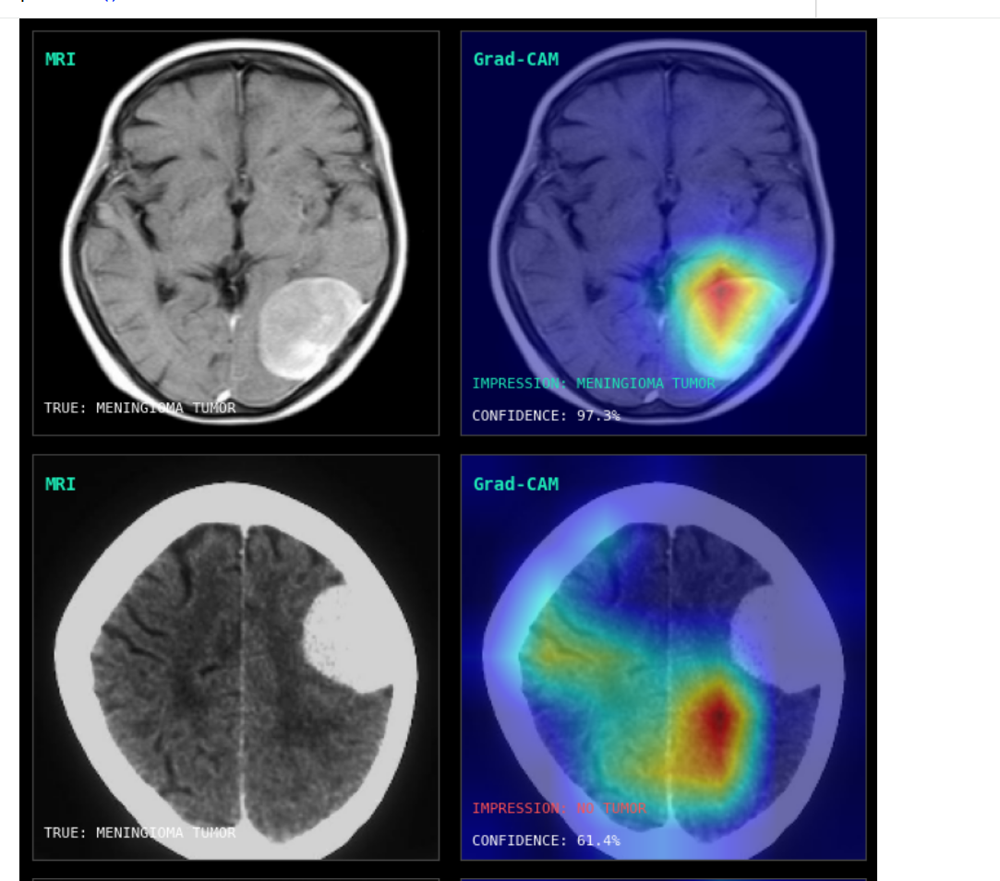
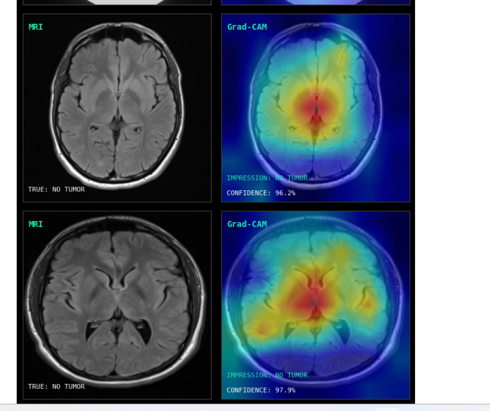
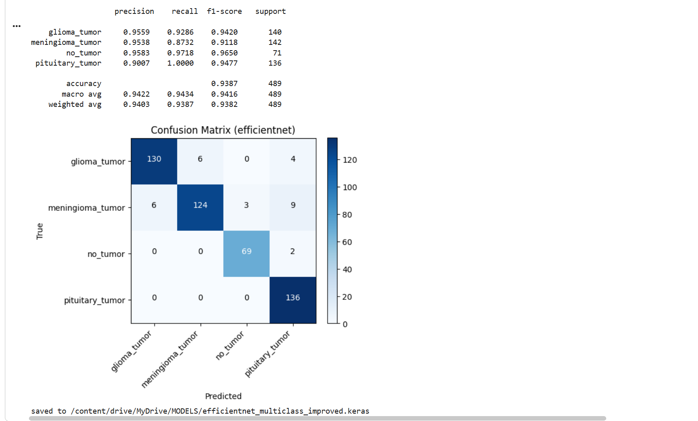
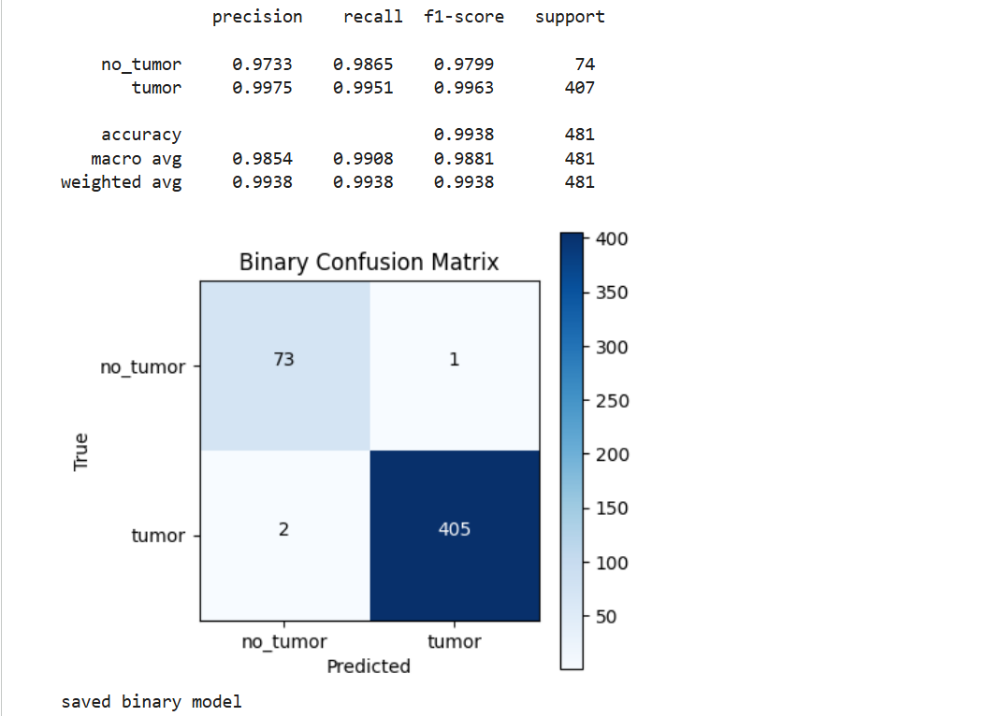
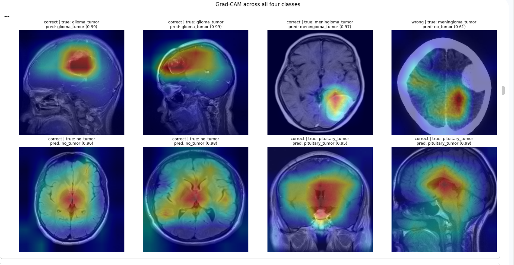
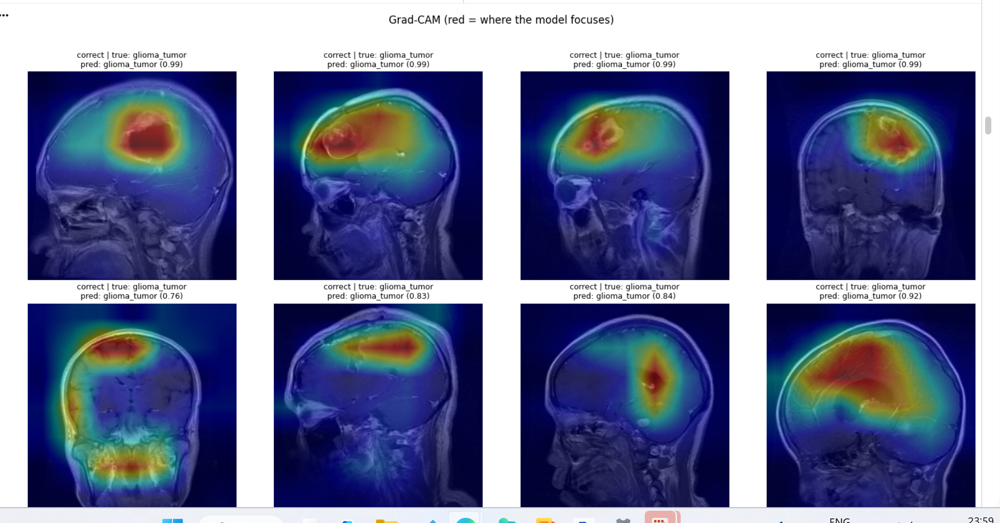

# Brain Tumor MRI Classification

Deep-learning classification of brain MRI scans using transfer learning, with
Grad-CAM interpretability to verify the model attends to actual tumor regions.
Two tasks are covered: binary (tumor vs. no-tumor) and 4-class tumor typing
(glioma, meningioma, pituitary, no-tumor).

> **Note:** This is a research and educational project. It is **not** a medical
> device and must not be used for real diagnosis.

## Demo

An interactive interface (Gradio) runs both models on an uploaded scan, shows a
Grad-CAM overlay of where the model looked, and gives grounded reasoning about
the result. Below, the clinical-viewer style pairs each grayscale MRI with its
Grad-CAM heat map and the model's impression + confidence.

Glioma case (99% confidence, heat localized on the lesion):



Meningioma case (97% confidence, focal heat on the mass):



No-tumor case (diffuse attention, no focal lesion):



---

## Results

Both models are EfficientNetB0, evaluated on clean stratified splits.

| Task                        | Accuracy       | Macro-F1        |
|-----------------------------|----------------|-----------------|
| Binary (tumor vs no-tumor)  | 99.4%          | 0.988           |
| 4-class (tumor typing)      | 94.75% ± 0.40% | 0.950 ± 0.004   |

The 4-class result is averaged over 3 random seeds. On the binary task,
no_tumor recall is 0.987 — of 74 healthy scans only 1 was missed — which is the
key safety-relevant metric.

Multiclass confusion matrix:



Binary confusion matrix:



Per-class performance (representative run):

| Class            | Precision | Recall | F1    |
|------------------|-----------|--------|-------|
| glioma           | 0.96      | 0.93   | 0.94  |
| meningioma       | 0.95      | 0.87   | 0.91  |
| no_tumor         | 0.96      | 0.97   | 0.97  |
| pituitary        | 0.90      | 1.00   | 0.95  |

Meningioma is the hardest class, occasionally confused with glioma — consistent
with their visual similarity on MRI. Grad-CAM makes this visible: on the few
missed cases the heatmap is diffuse with no focal lesion, whereas correct
predictions localize tightly on the tumor.

---

## Method

- **Backbone:** EfficientNetB0 (ImageNet weights), ResNet50 compared as baseline.
- **Input:** 224×224 RGB, normalized with the backbone's own `preprocess_input`.
- **Augmentation:** horizontal flip, small rotation, zoom, and contrast, applied
  before normalization.
- **Two-stage training:** (1) train the classifier head with the backbone frozen;
  (2) unfreeze the upper layers and fine-tune at a low learning rate (3e-5) with
  cosine-style scheduling, early stopping, and LR reduction on plateau.
- **Class imbalance:** square-root-damped class weights (full inverse-frequency
  weights over-corrected and hurt minority classes).
- **Loss:** categorical cross-entropy with label smoothing (0.05).
- **Evaluation:** stratified 70/15/15 split pooled from the original folders, so
  train/val/test share the same distribution. Reported over 3 seeds.

---

## Repository structure

```
code/
  FINAL CODE FOR BEST MODEL(MULTICLASSIFIER)/   # main 4-class notebook
  FINAL CODE FOR BEST MODEL(BINARY)/            # main binary notebook
  UI code/                                      # Gradio dual-model interface
  DATAIL CODE For Comparison/                   # baseline & comparison runs
```

---

## Dataset

Brain Tumor MRI dataset with four categories: glioma, meningioma, pituitary,
and no-tumor. Images are organized into class subfolders. In this project the
original train/val/test folders are pooled and re-split with stratification to
avoid distribution mismatch between the provided splits.

Expected layout after unzip:

```
DATA/
  Training(70%)/<class>/*.jpg
  Validation(20%)/<class>/*.jpg
  Testing(10%)/<class>/*.jpg
```

---

## Running (Google Colab)

1. Mount Drive and unzip the dataset:
   ```python
   from google.colab import drive
   drive.mount('/content/drive')
   !unzip -o -q "/content/drive/MyDrive/DATA.zip" -d "/content/"
   ```
2. Set a GPU runtime (Runtime → Change runtime type → T4 GPU).
3. Open the multiclass notebook and run the cells in order:
   re-split → train → evaluate → Grad-CAM.

---

## Interpretability

Grad-CAM is generated from the backbone's last convolutional layer and overlaid
on the input scan (a grayscale clinical-viewer style is also provided). This
confirms the model localizes to tumor tissue rather than skull or scanner
artifacts, and explains where and why misclassifications occur.



Multiple glioma cases, showing consistent focus on the tumor region:



---

## Limitations

- Trained and evaluated on a single public dataset; cross-dataset generalization
  is not yet tested.
- Not calibrated or clinically validated. Research use only.
